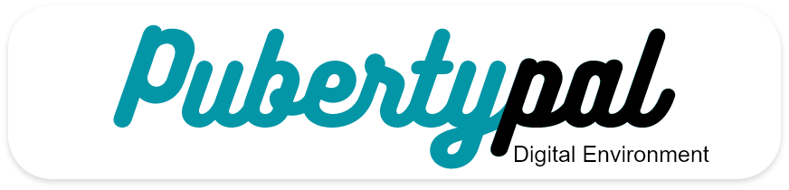
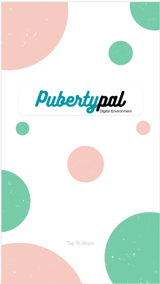
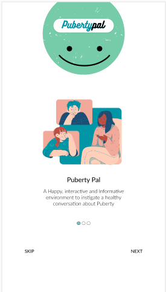
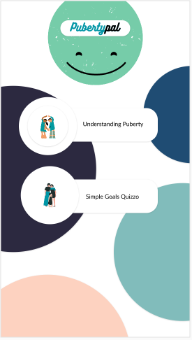
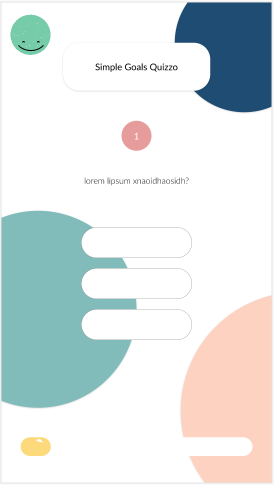
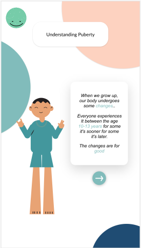
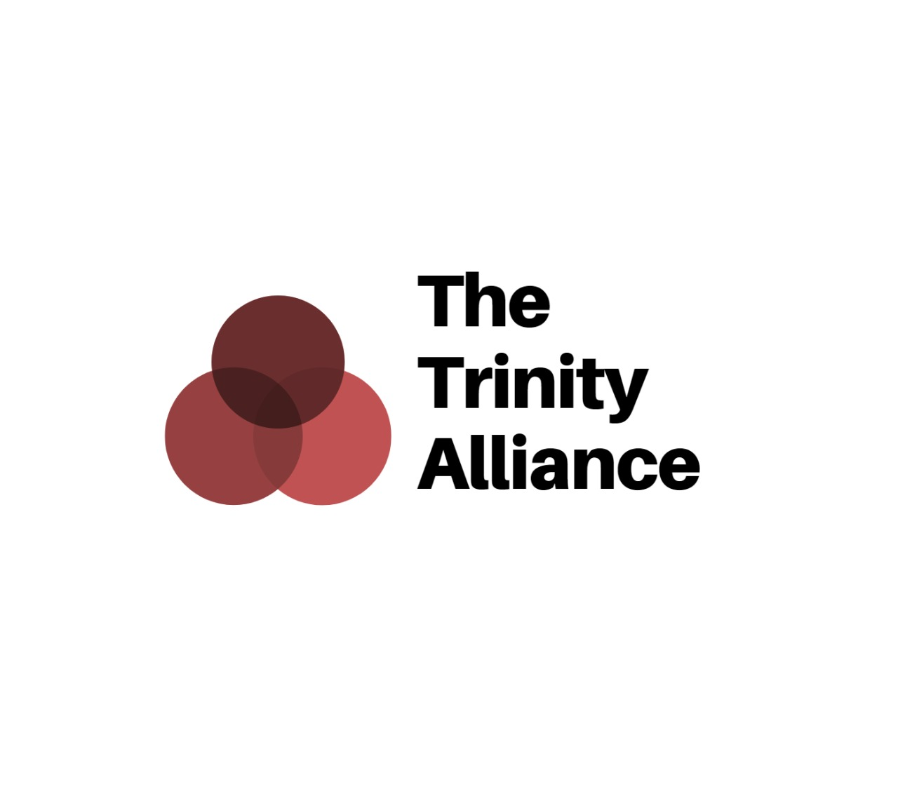

<!-- PROJECT LOGO -->
 

  

  <h3 align="center">PubertyPal!</h3>

  

    Puberty made easier!
     
    <a href="https://github.com/sanjaybaskaran01/PubertyPal-Frontend"><strong>Explore the docs »</strong></a>
     
     
    <a href="https://youtu.be/iuUWvDPpCeY">View Demo</a>
    ·
    <a href="https://github.com/sanjaybaskaran01/PubertyPal-Frontend/issues">Report Bug</a>
    ·
    <a href="https://github.com/sanjaybaskaran01/PubertyPal-Frontend/issues">Request Feature</a>
  

<!-- TABLE OF CONTENTS -->

  
Table of Contents

  <ol>
    <li>
      <a href="#about-the-project">About The Project</a>
      <ul>
        <li><a href="#built-with">Built With</a></li>
        <li><a href="#designed-with">Designed With</a></li>
      </ul>
    </li>
    <li><a href="#usage">Usage</a></li>
    <li><a href="#Demo">Demo</a></li>
    <li><a href="#Team">Team</a></li>
  </ol>

<!-- ABOUT THE PROJECT -->
## About The Project

[![PubertyPal][product-screenshot]](https://youtu.be/iuUWvDPpCeY)

Kids begin undergoing major changes in their body, due to puberty, between the ages 9 and 15 (for boys) and 7 and 13 (for girls). It has become quite a common phenomenon for them to feel insecure and alone when all these sudden changes occur. 
Many a times, they don’t know who to consult to or talk to within their own family as parents can tend to avoid answering questions which they deem to be awkward and uncomfortable. As a result, these young impressionable minds, can be afraid to feel comfortable in their own body. 
Some of the existing approaches include waiting for the right time to come, and/or involves parents waiting for the children to ask them questions and initiate a discussion. But how often does it occur, that a child knows when the right time is to ask a question or what sort of questions they can ask their parents without feeling ashamed.

PubertyPal is an app that is aimed at resolving these issues. It answers all the questions that a young mind could have regarding their changing bodies. It provides reassurance and comfort while conversing. PubertyPal also provides with prior-preparatory information that can be put to good use by the users to get ready or if they’re experiencing early changes (which is completely normal and okay).

### Built With

* [React Native](https://reactnative.dev/)
* [Expo](https://expo.io/)
* [TypeScript](https://www.typescriptlang.org/)
* [Node.JS](https://nodejs.org/en/)
* [Mongo DB](https://www.mongodb.com/)

### Designed With
* [AdobeXD](https://www.adobe.com/in/products/xd.html)
* [Adobe illustrator](https://www.adobe.com/in/products/illustrator.html?gclid=Cj0KCQjw-LOEBhDCARIsABrC0Tkh5XISyji5vFHvGD3WZpeInHqvxZ37agB-VBabA0oOAPgAU5x2C-gaAkdAEALw_wcB&sdid=SBNHMR64&mv=search&ef_id=Cj0KCQjw-LOEBhDCARIsABrC0Tkh5XISyji5vFHvGD3WZpeInHqvxZ37agB-VBabA0oOAPgAU5x2C-gaAkdAEALw_wcB:G:s&s_kwcid=AL!3085!3!248235017693!e!!g!!adobe%20illustrator!221172068!17525759228)
* [Adobe Photoshop](https://www.adobe.com/in/products/photoshop.html)

<!-- GETTING STARTED -->

<!-- USAGE EXAMPLES -->
## Usage
  
  
  
  
  
  

## Demo
[YouTube](https://youtu.be/iuUWvDPpCeY)

<!-- CONTACT -->
## Team

[product-screenshot]: Designs/home_page/screenshot.png
